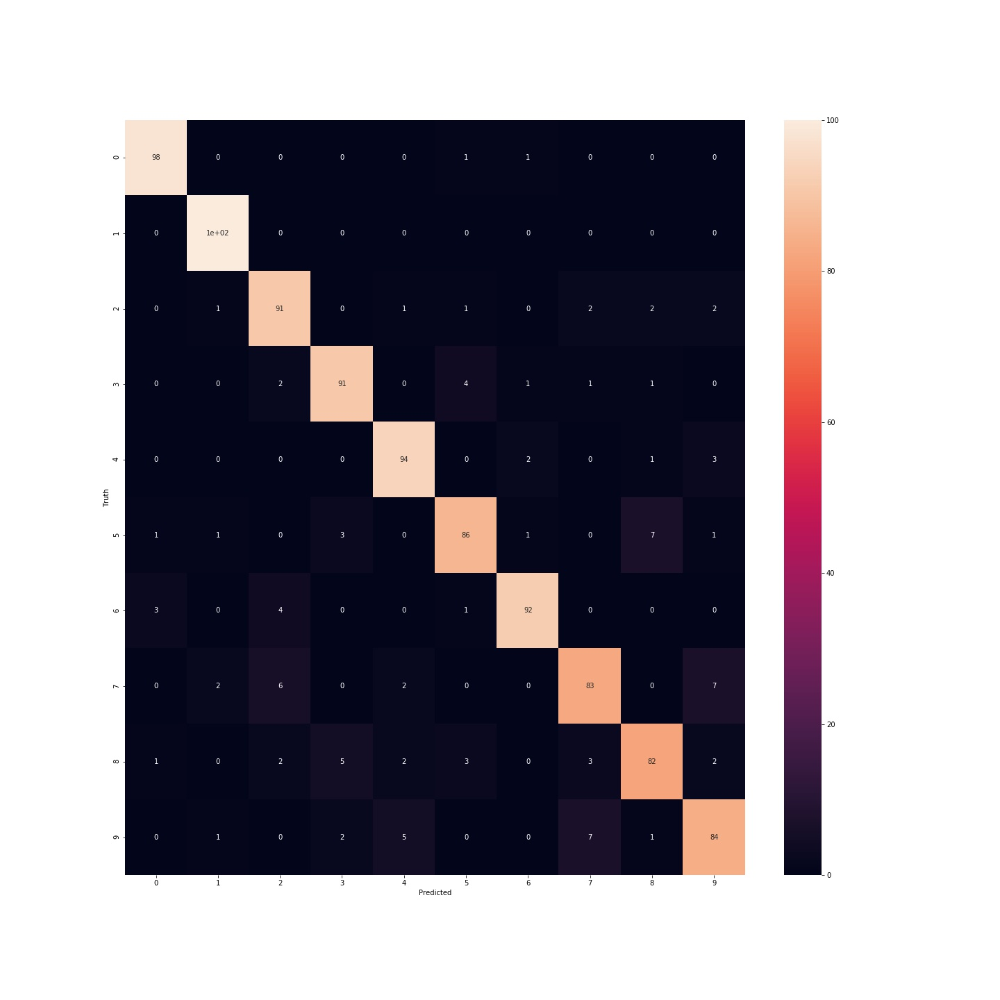
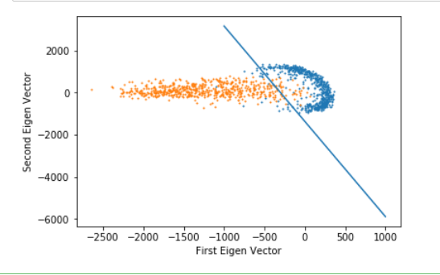
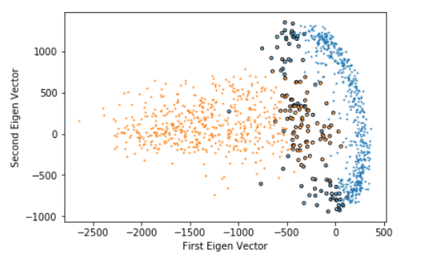
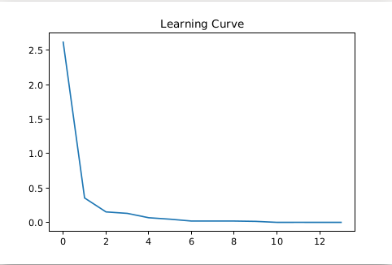
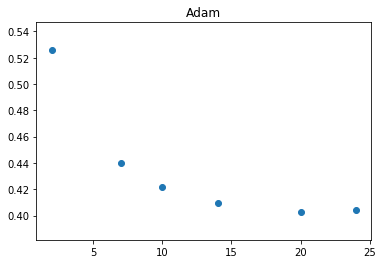
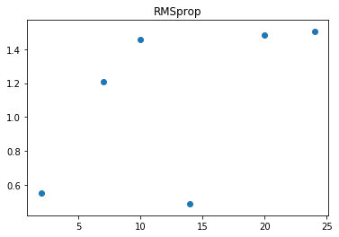
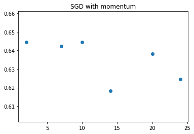
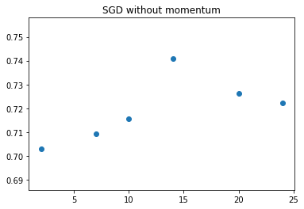

# MNIST Handwritten Digits Classification using various classifiers
## Dataset
Using a subset of the extremely popular simple data set MNIST. This data set has many images of handwritten digits 0 to 9. i.e., 10
classes. Each image is of size 28 ×28. In our subset there are 7000 images in total from 10 classes, out of which 6000
are for training and 1000 are for testing.

## Classification Methods

- Soft Max based classification
- Majority vote based classification using Logistic Regression
- Support Vector Machine
- MLP Classifier
- Autoencoders
- MLP Classifier with Autoencoder
- K-means

#### Accuracies Obtained from the above methods
* Softmax has an accuracy of 88.7 percent on the test data.

* Majority method has an accuracy of 90.1 percent. The accuracy is higher as we are taking maximum of all the local maximums. The confusion matrix is as follows:

* In the Support Vector Machine Method the data is reduced to two dimensions by Principal Component Analysis which is multiplication by the first two eigen vectors of the covariance matrix of data. The accuracy for C=0.00000000003 is 95.5 and C=1000000000000 is 96.5. The Decision Boundary and Support Vectors are as follows:

* MLP Classifier is used with to hidden layers of 1000 neurons, a learning rate of 0.0001 and 100 iterations. The accuracy is 99 percent. The Learning curve is as follows:

 

* On MNIST training datset an undercomplete autoencoder was used for feature learning and the "reconstruction error" Vs "hidden neurons" was plotted and analysed for various optimizers like SGD with and without momentum, Adam, RMSProp.

 
 
